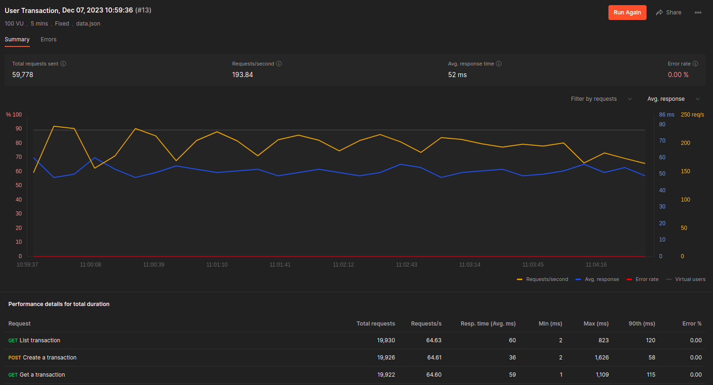
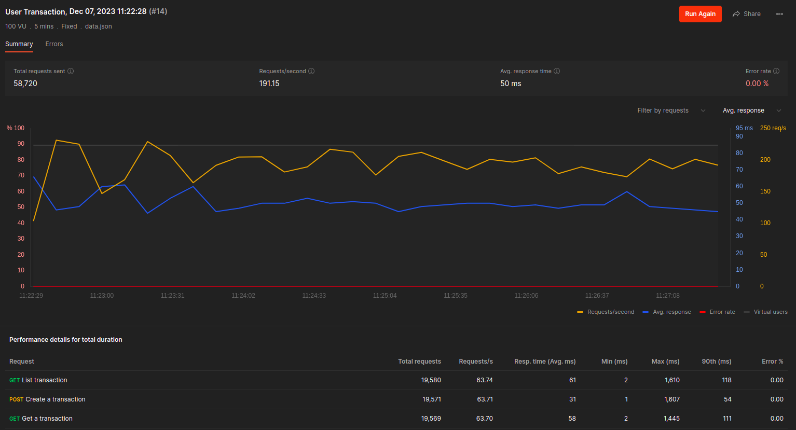
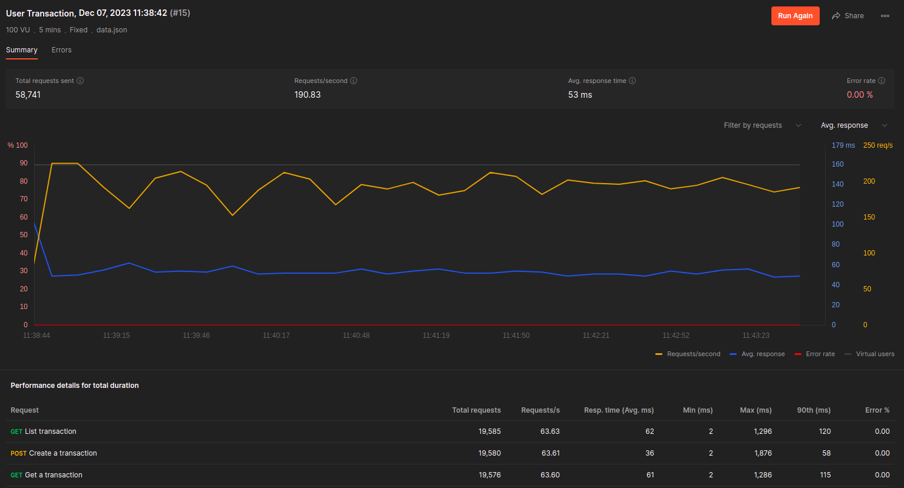
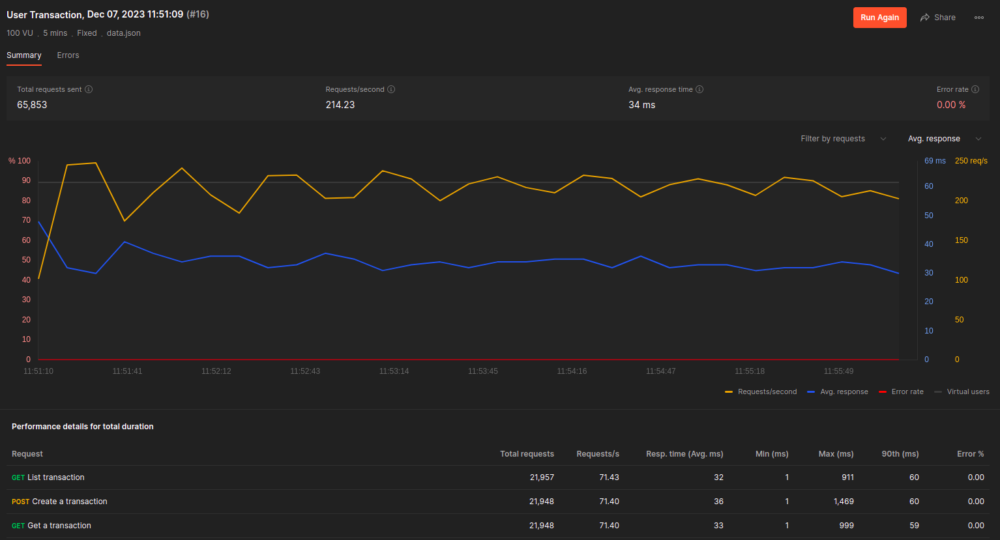
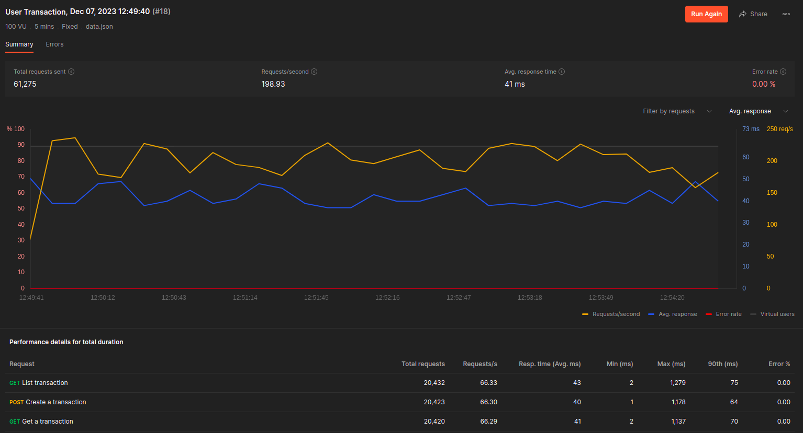
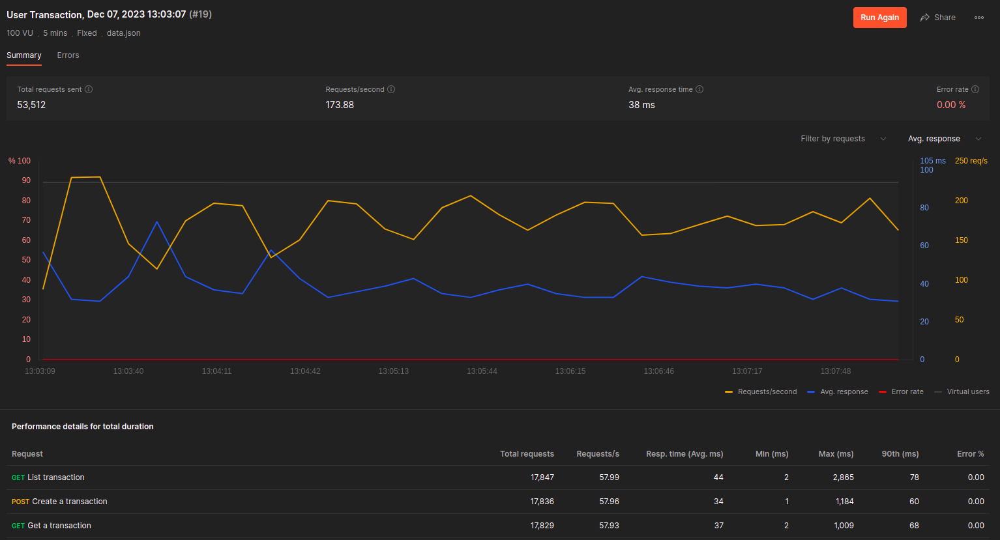
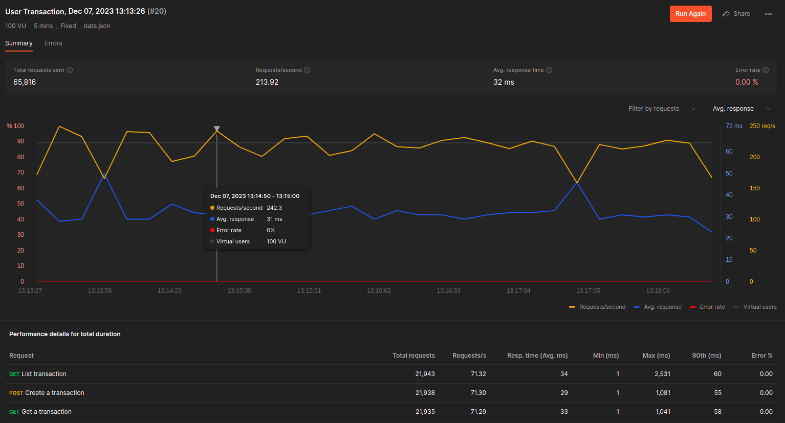

# First test

The tests were run on commit 52ca31ea68d44c33f469b81801d01ed94160d08a, serving as a baseline for the tests.



# Second test

Changed the Insert method to send to the bulk channel in a separate goroutine.



There are no significant changes in the results, slightly 90th and average percentile improved.

```go
go func() {
  r.InsertChan <- transaction
}()
```

# Third test

Change RunGroupTransactions to run the bulk create in a separate goroutine.



```go
go func(transactions ...*core.Transaction) {
  r.Db.Create(transactions)
}(bulk...)
```

# Fourth test

Use gorm pool connection



```go
sqlDB, _ := d.Db.DB()

// SetMaxIdleConns sets the maximum number of connections in the idle connection pool.
sqlDB.SetMaxIdleConns(10)

// SetMaxOpenConns sets the maximum number of open connections to the database.
sqlDB.SetMaxOpenConns(100)

// SetConnMaxLifetime sets the maximum amount of time a connection may be reused.
sqlDB.SetConnMaxLifetime(time.Hour)
```

Improved the total request, request per second, average. The 90th percentile is better in List and Find, increase a bit in Create.

# Fifth test

Use pgBouncer to pool connections



```docker-compose
  pgbouncer:
    image: edoburu/pgbouncer
    environment:
      - DB_USER=postgres
      - DB_PASSWORD=postgres
      - DB_HOST=database
      - DB_NAME=transactions
      - POOL_MODE=transaction
      - ADMIN_USERS=postgres
      # max_prepared_statements
      - MAX_PREPARED_STATEMENTS=1000
    depends_on:
      - database
    deploy:
      resources:
        limits:
          cpus: '1'
          memory: '1G'
```

The results were worse than the previous test.

# Sixth test

All tests combined.



The results response time was better but the total request and request per second were worse.

# Seventh test

All tests combined and without pgBouncer.



The results were better than the previous test, specially 90th percentile. The total request were lower than just using gorm pool connection.

# Conclusion

Just using the gorm pool connection was the best result. The pgBouncer was the worst result. The other tests were similar to the gorm pool connection, but the gorm pool connection was better and add less complexity to the project.
